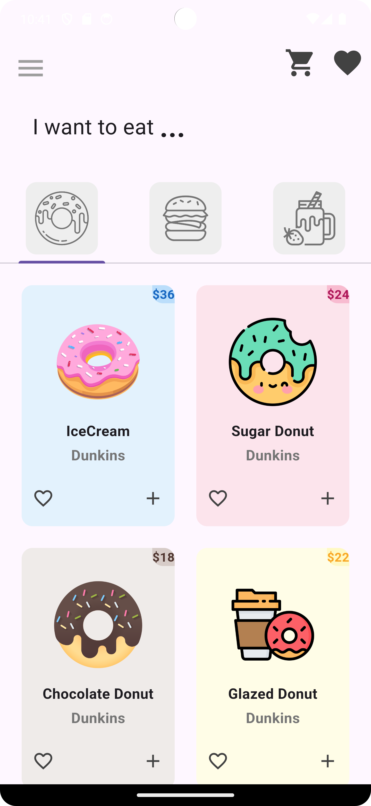
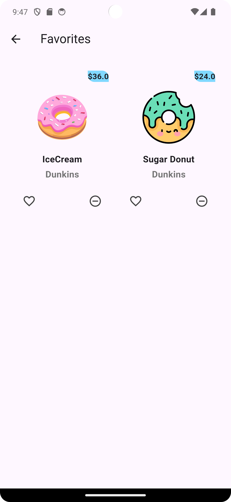
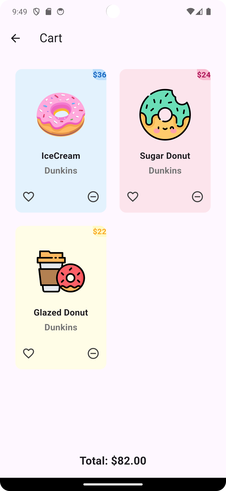
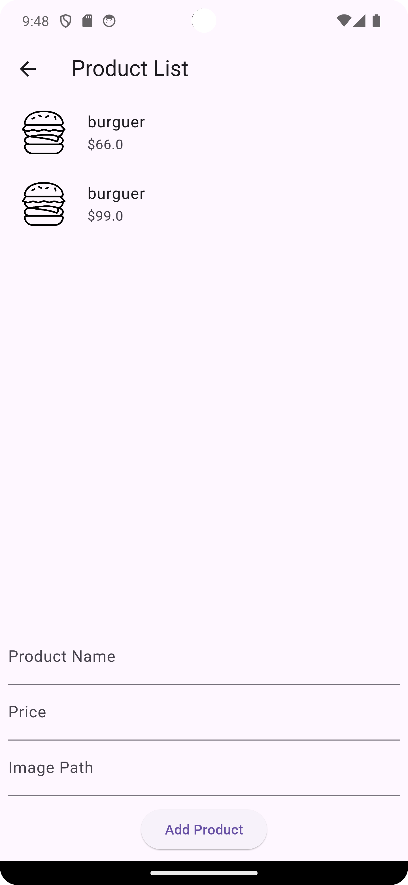

# Donut Store UI

O Donut Store UI é um aplicativo de exemplo que apresenta uma interface de usuário simples para uma loja de donuts. Este projeto foi desenvolvido em Flutter e usa a biblioteca Provider para gerenciar o estado e Firebase Cloud Firestore para armazenar dados como items favoritados.

## Capturas de Tela

## Recursos

- Exibição de donuts, hambúrgueres e smoothies em guias separadas.
- Adição de itens ao carrinho de compras.
- Funcionalidade de favoritar para itens. 
- Salvamento dos favoritos foi feito no Firestore.
- Remoção de itens do carrinho de compras e dos favoritos.
- Products List page é uma página exemplo de como poderíamos implementar para adicionar mais produtos na loja que também salva no Firestore.

## Dependências

Este projeto depende das seguintes bibliotecas Flutter:

- [Provider](https://pub.dev/packages/provider): Usado para gerenciar o estado do carrinho de compras e itens curtidos.
- [cloud_firestore](https://pub.dev/packages/cloud_firestore): Usado para integrar o Firestore para salvar e buscar os favoritos e itens.

Certifique-se de adicionar essas dependências ao arquivo `pubspec.yaml` do seu projeto.

## Como Usar

Para usar este projeto, siga estas etapas:

1. Clone este repositório.
2. Execute `flutter pub get` para instalar as dependências.
3. Configure o Firebase no seu projeto e adicione as credenciais ao seu arquivo `google-services.json` ou `Info.plist`.
4. Execute o aplicativo em seu emulador ou dispositivo.

## Proximos Passos

Meus próximos passos são:
- explorar gerenciar estados com getx e mobx.
